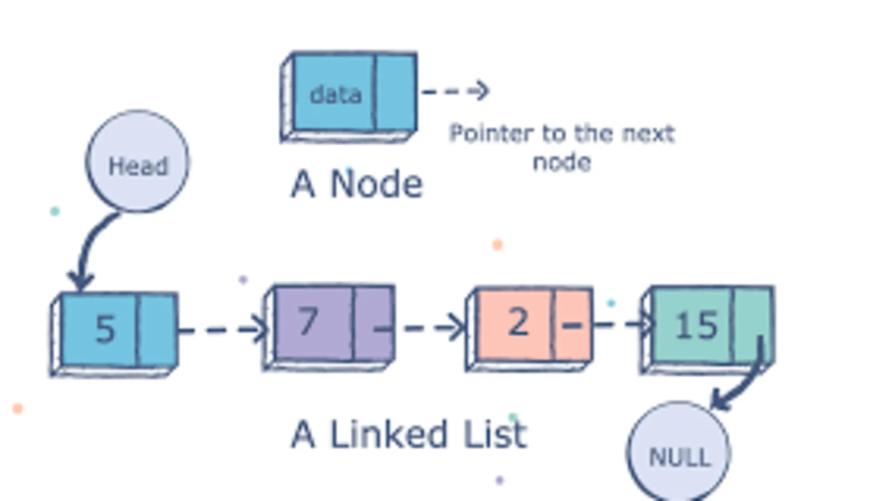

# What Is A Linked List
*it is a list that is linked*
*linked list is a data structure consisting of a group of vertices (nodes) which together represent a sequence*
*each vertex is composed of a data and a reference (link) to the next vertex*
*they are ordered*
*has a loose structure*
*it is a low-level data structure *

### Advantages
- loose structure that insert or delete in the middle of the list by resetting a few pointers
- inserting and deleting is fast
- the advantage over hash tables is that it has order as a node points to the next node
- ordered
- flexible Size

### Disadvantages
-  you have to traverse a linked list to read an item
-  linked list nodes are scattered around memory.
-  traversing through a linked list is usually slower than iterating through an array
-  slow lookup
-  more memory

### Big O
- prepend O(1)
- append O(1)
- lookup O(n)
- insert O(n)
- delete O(n)